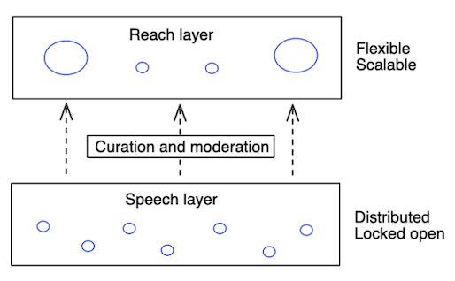
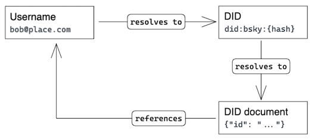
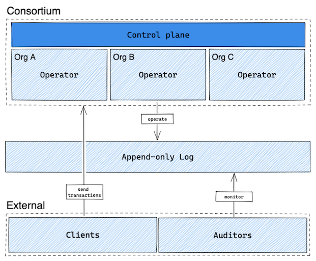
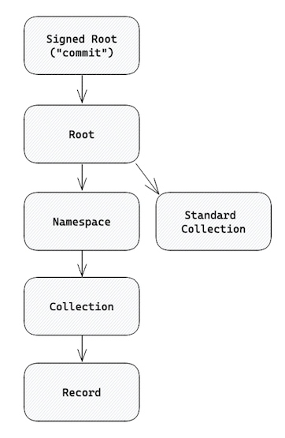
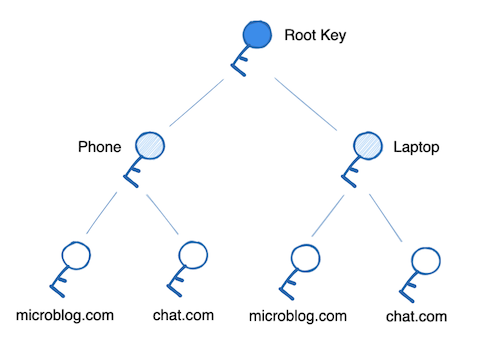
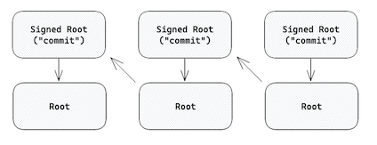
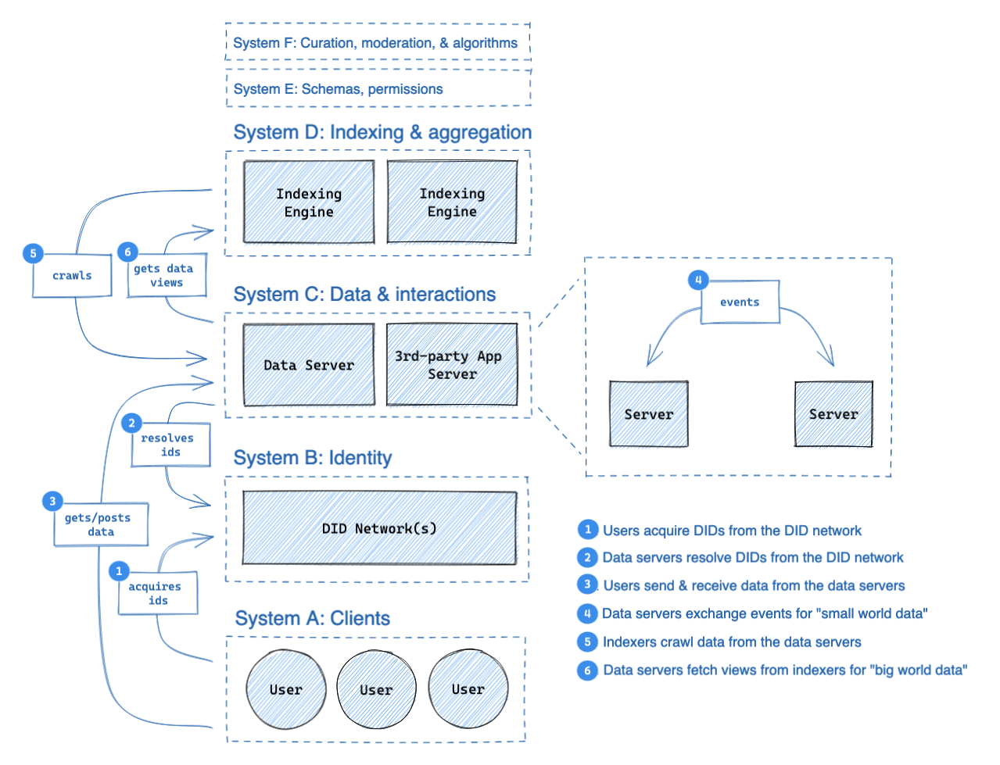
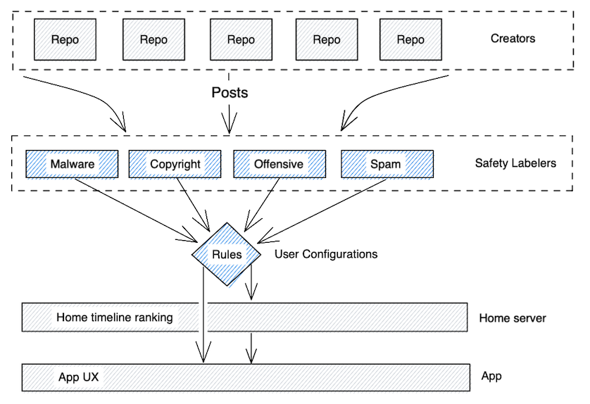

# Authenticated Data eXperiment (ADX) Overview

## Summary

Bluesky is building a protocol for large-scale distributed social applications. We want public discourse to occur on open infrastructure which gives users a choice in their experience, creators control over their relationships with their audience, and developers freedom to innovate without permission from a platform. 

We're calling what we’re putting out the Authenticated Data eXperiment, or _ADX_. It’s an "experiment" at this stage because the protocol is actively under development and will evolve as our understanding improves. All documentation and code is a working prototype and should be considered unstable.

The core of ADX is [self-authenticating data](https://blueskyweb.xyz/blog/3-6-2022-a-self-authenticating-social-protocol). In law, a [“self-authenticating” document](https://www.law.cornell.edu/rules/fre/rule_902) requires no extrinsic evidence of authenticity. In computer science, an [“authenticated data structure”](https://www.cs.umd.edu/~mwh/papers/gpads.pdf) can have its operations independently verified. When resources in a network can attest to their own authenticity, then that data is inherently _live_ – that is, canonical and transactable – no matter where it is located. This is a departure from the connection-centric model of the Web, where information is host-certified and therefore becomes _dead_ when it is no longer hosted by its original service. Self-authenticating data moves authority to the user and therefore preserves the liveness of data across every hosting service. 

This document is a working summary of the protocol’s development which describes the various techniques and components involved.

### Understanding the protocol

ADX demonstrates two core components of self-authentication: [cryptographic identifiers](https://en.wikipedia.org/wiki/Public-key_cryptography) and [content-addressed data](https://en.wikipedia.org/wiki/Content-addressable_storage). We've built ADX using existing tools and standards when possible, including [IPLD](https://ipld.io/), [DIDs](https://w3c.github.io/did-core/), and [UCANs](https://fission.codes/blog/auth-without-backend/).

_Cryptographic identifiers_ associate users with public keys. [Self-sovereign identity](https://en.wikipedia.org/wiki/Self-sovereign_identity) is based on having cryptographic identifiers for users. Control of an account is proved by a cryptographic signature from a user, rather than an entry in a database keeping track of logins.

_Content-addressed data_ means content is referenced by its cryptographic hash — the unique digital “fingerprint” of a piece of data. Using public keys and content-addresses, we can sign content by the user's key to prove they created it. Authenticated data enables trust to reside in the data itself, not in where you found it, allowing apps to move away from client-server architectures. This creates “user-generated authority”.

While these components are common to peer-to-peer networks, ADX uses a federated networking model. Federation was chosen to ensure the network is convenient to use and reliably available. Using self-authenticating data, we're able to create portability between ADX services, including the ability to change hosting providers without losing your identity or social graph.

It can be helpful to draw an analogy from ADX to the Web. Today, every time someone creates a post or engages with content on a social platform (likes, follows, etc), they're creating data about themselves. On the Web, this data lives on the social platform where it was created. In ADX, this data will live in Personal Data Repositories owned by the user. These repositories are similar to websites in the sense that they represent content published by one user, but they use self-authenticating data to identify themselves independently of the host servers. We then create a larger, more interconnected view of the network by crawling the repositories with indexers.

The role of indexers mirrors how search engines like Google interact with the Web. The Web itself is an open and decentralized layer for content. Google collects, ranks, and filters that content into a service that it surfaces for users when they search. Our "Crawling Indexers" are much the same, except they collect the content for social applications. They select content to index and can then extract a filtered view for their users.

This model has been proven to scale for Web search, and we believe the same scaling techniques will apply here. It's also extremely flexible; anybody can create a crawling indexer to produce a new view of the network. Our approach follows a principle of _loose coupling_ between systems, as is the case between Personal Data Repositories and the Crawling Indexers, in order to enable user-choice and evolvability throughout the network. Other systems such as Identity, Usernames, and Key Management follow this principle as well.

### Moderation in a protocol-based world

It’s not possible to have a usable social network without moderation. Decentralizing components of existing social networks is about creating a balance that gives users the right to speech, and services the right to provide or deny reach.

Our model is that _speech_ and _reach_ should be two separate layers, built to work with each other. The “speech” layer should remain neutral, distributing authority and designed to ensure everyone has a voice. The “reach” layer lives on top, built for flexibility and designed to scale.

The base layer of ADX (Personal Data Repositories and Federated Networking) creates a common space for speech where everyone is free to participate, analogous to the Web where anyone can put up a website. The Crawling Indexer services then enable reach by aggregating content from the network. Moderation occurs during aggregation or by end-user choice of who they follow and block. There's no one company that can decide what gets published; instead there is a marketplace of companies deciding what to carry to their audiences.

Separating speech and reach gives indexing services more freedom to moderate. Moderation action by an indexing service doesn't remove a user's identity or destroy their social graph – it only affects the services' own indexes. Users choose their indexers, and so can choose a different service or to supplement with additional services if they're unhappy with the policies of any particular service.

It's important to recognize that hosting providers will be obligated to remove illegal content according to their local laws. To help providers fulfill this obligation, services can publish labels which providers act upon at their discretion. For more information, see the "Moderation" section.

## Identity

### Requirements

The identity system has a number of requirements:

* **ID Provision.** Users should be able to create global IDs which are stable across services. These IDs should rarely change to ensure that links to their content are stable.
* **Public key distribution.** Distributed systems rely on cryptography to prove the authenticity of data and provide end-to-end privacy. The identity system must publish their public keys with strong security.
* **Service discovery.** To interact with users, applications must be able to discover the services in use by a given user.
* **Usability.** Users should have human-readable and memorable names.
* **Portability.** Identities should be portable across services. Changing a provider should not cause a user to lose their identity, social graph, or content

Adopting this system should give applications the tools for end-to-end encryption, signed user data, service sign in, and general interoperation.

### Identifiers

We use two interrelated forms of identifiers: the _username_ and the _DID_. Usernames are email-like IDs which are resolved using [Webfinger](https://webfinger.net/) while DIDs are an [emerging W3C standard](https://www.w3.org/TR/did-core/) which act as secure & stable IDs.

The email-style username is a user-facing identifier — it should be shown in UIs and promoted as a way to find users. Applications resolve usernames to DIDs and then use the DID as the stable canonical identifier. The DID can then be securely resolved to a DID document which includes public keys and user services.

<table>
  <tr>
   <td><strong>Usernames</strong>
   </td>
   <td>Usernames are email-style (user@domain). They are resolved to DIDs using the <a href="https://webfinger.net/">Webfinger</a> protocol and must be confirmed by a matching entry in the DID document.

By using Webfinger, the allocation and management of usernames are delegated to DNS (for the part after the @) and the admins of the Webfinger HTTP endpoints (for the part before the @).
   </td>
  </tr>
  <tr>
   <td><strong>DIDs</strong>
   </td>
   <td>DIDs are an emerging<a href="https://www.w3.org/TR/did-core/"> W3C standard</a> for providing stable & secure IDs. They are used as stable, canonical IDs of users.

The DID syntax supports a variety of “DID methods” that define how the DID is published and modified. This document proposes creating a new method which is operated by a consortium of providers.
   </td>
  </tr>
  <tr>
   <td><strong>DID Documents</strong>
   </td>
   <td>DID Documents are standardized objects which are hosted by DID registries. They include the following information:
<ul>

<li>The username associated with the DID

<li>User public-key material

<li>Pointers to the user’s services

DID Documents provide all the information necessary for a client to begin interacting with a given user and their content.
</li>
</ul>
   </td>
  </tr>
</table>

### DID Methods

The [DID standard](https://www.w3.org/TR/did-core/) supports custom "methods" of publishing and resolving DIDs to the [DID Document](https://www.w3.org/TR/did-core/#core-properties). A variety of existing methods [have been published](https://w3c.github.io/did-spec-registries/#did-methods) so we must establish criteria for fitness in this proposal:

- **Strong consistency.** For a given DID, a resolution query should produce only one valid document at any time. (In some networks, this may be subject to probabilistic transaction finality.)
- **High availability**. Resolution queries must succeed reliably.
- **Online API**. Clients must be able to publish new DID documents through a standard API.
- **Secure**. The network must protect against attacks from its operators, a MITM, and other users.
- **Low cost**. Creating and updating DID documents must be affordable to services and users.
- **Key rotation**. Users must be able to rotate keypairs without losing their identity.
- **Decentralized governance**. The network should not be governed by a single stakeholder; it must be an open network or a consortium of providers.

Many existing DID networks are permissionless blockchains which achieve the above goals but with relatively poor latency ([ION](https://identity.foundation/ion/) takes roughly 20 minutes for commitment finality). Other methods such as "did:web" may be ideal for self-hosting users but lack an online API and so must be iterated upon to meet our requirements.

While we believe supporting the existing methods which meet these criteria is a good idea, we also believe a better approach can be provided by building a new DID Consortium registry.

### The DID Consortium

The (currently-unnamed) DID Consortium will securely host user IDs at a low cost to users. It will be operated by multiple different organizations who share ownership of the service.

The design of the consortium software is still under development, but the current thinking follows the above diagram. Consortium members will operate nodes which coordinate under a control plane run by the consortium governance. They will coordinate reads and writes to a secure append-only log which can be monitored externally, through a technique similar to [Certificate Transparency](https://certificate.transparency.dev/).

Clients (users) will submit reads and writes to members of the consortium. External auditors will be able to follow the log to watch for unexpected identity changes and ensure the consortium is operating as intended.

### Consortium ID format and data model

DID Documents published to the Consortium will be identified by a hash of the initial document (known as the "genesis" document). This genesis doc includes the public key for a primary keypair which signs the genesis doc and any subsequent updates. Updates can change the primary public key, in which case subsequent updates to the document should be signed by the new keypair. A recovery keypair may also be included in the document with superseding capacity to sign updates.

To correctly host a DID Document and its changes, the consortium must maintain the history of the document – or at minimum the history of its key rotations – and act as a trusted witness to the history. If it fails to do so, a compromised keypair could be used to rewrite the history and claim control of an account, even after rotation. The purpose of the append-only transparency log is to ensure that the consortium is maintaining this property.

### Root private key management

Many of our systems depend on cryptographic keypairs which are managed by end-users. We believe users should be given the options to use both custodial and non-custodial solutions. Key management is (at this stage) difficult for average consumers and so a custodial solution should be made available, but for professionals and security-conscious users a non-custodial option should also be supported.

The key manager has the following responsibilities:

- Store root private keys
- Publish updates to the users' DID Documents
- Create delegated keypairs through [UCAN](https://ucan.xyz/) issuance (see "Data Repositories" for more info)
- Handle recovery flows in the event of key loss

The key manager software integrates into the application stack in a similar fashion to SSO services. When applications want to "log in" (gain authorization) the key manager is opened with a chance for the user to choose the identity and accept or deny the grant. When core account management is needed (e.g. to change a service provider) the key manager will provide interfaces to update this config.

The key management software is seldom used, though it plays a critical role. The key manager provides an interface to authenticate/deauthenticate a new device and manage core configuration details about a user’s account.

### Notes on design decisions

Designing the identity system is a balancing act between requirements and resulting complexity. It can be useful to track how decisions affect the design, to better justify the proposal and to get entry-points to future discussion.

- **Key rotation**. Supporting key rotation for users is a valuable feature but it means that public keys cannot act as a user identifier. Instead, a content-hash of the DID document is used, and pubkeys are embedded in the document. Key changes are maintained as a history to the document. While all such updates are signed by the users' keypairs (main or recovery), a compromised keypair could be used to modify the history of key rotations. Therefore the registry must provide a trusted history for each DID document.
- **Stable DIDs**. Maintaining a stable DID keeps the network healthy (fewer broken links) and reduces the potential that users lose their social graph or content. It does, however, require a more sophisticated DID Method which must provide that stability. Hypothetically, if we were to loosen this requirement, eg to enable a provider domain name to be part of the DID, it would reduce the amount of coordination needed within the registry.
- **Online API**. DID Documents include the users' pubkeys and service endpoints. Ideally the software should be able to update the documents in convenient flows, but this requires an API for the client software to publish updates. If we can find reasonable flows for manual updates then DID methods without an online API such as did:web would also be usable.
- **Transparency log**. The use of an append-only transparency log in the consortium mandates that the history of all mutations must be stored, creating an unbounded growth of state.

## Personal Data Repositories

A “Personal Data Repository” is a collection of data published by a single user. Repositories are self-authenticating data structures, meaning each update is signed by an authenticated key, includes a proof of that authority, and can have its authenticity verified by anyone through a deterministic algorithm. The content of a repository is laid out in a [Merkle DAG](https://docs.ipfs.io/concepts/merkle-dag/) which reduces the state to a single root hash. This graph of hashes helps quickly compare two repository states which enables more efficient replication protocols.

### Identifier Types

Multiple types of identifiers are used within a Personal Data Repository.

<table>
  <tr>
   <td><strong>DIDs</strong>
   </td>
   <td><a href="https://w3c.github.io/did-core/">Decentralized IDs (DIDs)</a> identify data repositories. They are broadly used as user IDs, but since every user has one data repository then a DID can be considered a reference to a data repository. The format of a DID varies by the “DID method” used but all DIDs ultimately resolve to a keypair and list of service providers. This keypair can sign commits to the data repository, or it can authorize UCAN keypairs which then sign commits (see “Permissioning”).
   </td>
  </tr>
  <tr>
   <td><strong>CIDs</strong>
   </td>
   <td><a href="https://github.com/multiformats/cid">Content IDs (CIDs)</a> identify content using a fingerprint hash. They are used throughout the repository to reference the objects (nodes) within it. When a node in the repository changes, its CID also changes. Parents which reference the node must then update their reference, which in turn changes the parent’s CID as well. This chains all the way to the Root node, which is then signed to produce a new commit.
   </td>
  </tr>
  <tr>
   <td><strong>TIDs</strong>
   </td>
   <td>Timestamp IDs (TIDs) identify records. They are used in Collections as a key to Records. TIDs are produced using the local device’s monotonic clock e.g. microseconds since Unix epoch. To reduce the potential for collisions, a 10-bit clockID is appended . The resulting number is encoded as a 13 character string in a sort-order-invariant base32 encoding (`3hgb-r7t-ngir-t4`).
   </td>
  </tr>
</table>

### Data Layout

Each Data Repository is laid out in a Merkle DAG which can be visualized as the following layout:

Every node is an[ IPLD](https://ipld.io/) object ([dag-cbor](https://ipld.io/docs/codecs/known/dag-cbor/) to be specific) which is referenced by a[ CID](https://github.com/multiformats/cid) hash. The arrows in the diagram above represent a CID reference.

<table>
  <tr>
   <td><strong>Signed Root ("commit")</strong>
   </td>
   <td>The Signed Root, or “commit”, is the topmost node in a repo. It contains:
<ul>

<li><strong>root</strong> The CID of the Root node.

<li><strong>sig</strong> A signature.
</li>
</ul>
   </td>
  </tr>
  <tr>
   <td><strong>Root</strong>
   </td>
   <td>The Root node contains:
<ul>

<li><strong>did</strong> The DID of this repository.

<li><strong>prev</strong> The CID(s) of the previous commit node(s) in this repository’s history.

<li><strong>new_cids</strong> An array of CIDs which were introduced in the write which produced this root.

<li><strong>relationships</strong> The CID of the “Relationships” Standard Collection, a HAMT which encodes the user’s social graph.

<li><strong>namespaces</strong> A map of Namespace nodes where the key is the Namespace’s string ID and the value is its CID.

<li><strong>auth_token</strong> The jwt-encoded UCAN that gives authority to make the write which produced this root.
</li>
</ul>
   </td>
  </tr>
  <tr>
   <td><strong>Namespace</strong>
   </td>
   <td>A Namespace represents a set of schemas which maps to the Collections within it. A Namespace node contains a set of Collections where the key is the Collection’s string ID and the value is its CID.
   </td>
  </tr>
  <tr>
   <td><strong>Collection</strong>
   </td>
   <td>A Collection is a key/value collection which maps a schema-specific key such as a TID or DID to a Record — specifically, to the Record’s CID. The data structures used by Collections are listed below in Collection Data Structures.
   </td>
  </tr>
  <tr>
   <td><strong>Record</strong>
   </td>
   <td>A Record is simply an object. The schema of each Record is determined by the Namespace & Collection it is within.
   </td>
  </tr>
  <tr>
   <td><strong>Standard Collection</strong>
   </td>
   <td>Standard Collections are Collections which exist outside of a Namespace, meaning their schema is encoded into the protocol rather than by applications.

Currently the following Standard Collections are being used:
<ul>

<li><strong>Relationships</strong>. A list of followed users. 
<ul>
 
<li><strong>did</strong> The DID of the user.
 
<li><strong>username</strong> The username of the user.
</li> 
</ul>
</li> 
</ul>
   </td>
  </tr>
</table>

### Collection Data Structures

The Collection nodes each use one of the following data structures.

<table>
  <tr>
   <td><strong>HAMT</strong>
   </td>
   <td>A<a href="https://en.wikipedia.org/wiki/Hash_array_mapped_trie"> Hash Array Mapped Trie (HAMT)</a> is a collection which is efficient at lookups but which orders keys by a hash function, thus producing “random” orderings with range queries. They are used for nominal data where order is not useful on the range queries such as the “Relationships” Standard Collection, where DIDs function as the key.
   </td>
  </tr>
  <tr>
   <td><strong>SSTable</strong>
   </td>
   <td>The<a href="https://www.igvita.com/2012/02/06/sstable-and-log-structured-storage-leveldb/"> Sorted String Table (SSTable)</a> is a collection which optimizes both read and write performance at the cost of some periodic book-keeping. Unlike the HAMT, SSTables do maintain a lexicographic ordering of the keys in range queries, making them more useful for ordinal data than the HAMTs. Recent tables are kept small, and as they grow older - and thus less likely to change - they are periodically compacted into larger tables. This is a technique borrowed from log-structured merge trees. By default, Collections use the SSTable with TID keys.
   </td>
  </tr>
</table>

### Permissioning

ADX requires a model for delegating write-authority to the Personal Data Repository so that multiple applications can interact with the user's data. The model chosen is a capabilities-based delegation to keypairs possessed by devices and applications.

All authority for a data repository derives from a master keypair which is declared in the user’s DID document. This key can be thought of as having “Super User” access to the user’s account. That is, it has the authority to do absolutely any action on behalf of the user.

The master keypair requires strong security and should not be duplicated to multiple locations or enter low-security environments such as the browser. This makes it difficult to access every time a new repository commit needs to be produced. Therefore we issue child keypairs from the master keypair in the form of[ UCANs](https://fission.codes/blog/auth-without-backend/), a JWT-style token that contains a permission description. UCANs can prove the authority of some key to undertake a given action, _or_ produce new UCANs with a subset of their authority. Through this mechanism, a user is actually associated with _many_ (likely hundreds) of keys, each belonging to a given context (a device or an application). These keys are granted only the authority they require from the root signing key. 

This leads to a tree of authorized keypairs such as the one in this diagram:

### Commits

Every mutation to the repository produces a new Root node because Repositories are[ Merkle DAGs](https://docs.ipfs.io/concepts/merkle-dag/). A “commit” to a data repository is simply a keypair signature over a Root node’s CID.

The signature on a commit may come from the designee of any valid UCAN which belongs to the repository, not just the master keypair. However, the changes that are encoded in the new commit must comply with the permissions given to the UCAN. The UCAN that allows for the change is attached to the root object. Validation of a commit can occur at any node (it is deterministic) but it will often occur at the user’s primary Personal Data Server. Invalid commits should be discarded.

To validate a data repository’s current state, the full history of commits must be validated. This can be accomplished by walking backwards through the “previous commit” pointers. This approach leaves two challenges: UCAN expiry and history compaction. Both of these tasks are under development and may simply rely on periodic checkpoint commits by the user’s master key.

#### History

Every Root node includes the CID of the previous Commit. This produces a linked list which represents the history of changes in a Repository.

#### Validation

Each commit can be validated by doing the following:

- Walk the repo structure to determine what changes were made
- Check that the changes made fall within the permissions of the UCAN attached to the root
- Check that the UCAN is valid (proper attenuation chain, root issuer is the root DID of the account, within time bounds, etc)
- Check that the audience of the UCAN attached to the root matches the public key of the signature in the commit
- Verify that the signature on the commit is a valid signature of the root CID

Full validation of the authenticity of the repo is done by walking backwards through commits and forming the above steps for each write to the repository. This operation will be done very seldomly, as most validators will only be verifying one commit at a time.

#### Merges

Merging can be done in two ways:

**Splitting and merging in repo history**: Each root node can refer to _one or more_ previous commits. Therefore, two clients can produce two parallel histories of the repository, and some third actor can merge them together by appending a merge commit that combines the changes from each history. Authorization for these sorts of actions may be tightly scoped such that a personal data server has the authority to perform “repository maintenance” such as merges, but not writes to your repository.

**Forced rebase**: In the event that the data server (or coordinating entity) is unable to perform a merge, it can reject an update from a client that is behind the root. It then forwards the current state of the repository to the client which rebases the changes it made off the current state of the repository.

### Deletions

ADX needs three distinct concepts for removing content from a repository. Sometimes you simply want to indicate that a post represents outdated information. Other times you are trying to clean up leaked data. The different removal scenarios lead to at least these three cases.

#### Retractions (soft removal)

The softest of the deletions is the retraction. This is accomplished by adding data to the repository that indicates that a prior record (e.g. a post) is marked as deleted. UX should not show this post but may want to do so when asked. Examples of when a retracted record might be shown is a time travel query, or if there are no results for a query the UX may ask the user if they want to expand the search to deleted and spam posts.

The record and retraction are both considered part of the repository and the repo is not considered a full clone if the retractions are missing. A shallow clone however may want to download only the retractions and not the retracted records.

#### Deletions (optional removal)

Deletions are a middle form of a removal. When a record has been deleted, the deletion stays in the repo but the record may be dropped. For this reason the Deletion needs to contain a hash of the record so the older merkle trees can still be validated. It is at the discretion of the server of the repo to either continue storing the deleted data or to compact the repo and remove the data. 

Deleted data should not count agent storage quota. This is essentially a “don't care”. If you want to store this data and return it for queries that rely on retracted data that is at the discretion of the host, as the repo is considered complete without this data.

#### Purge Requests (hard removal)

Purge Requests are the hard delete of ADX. When a user performs a purge of data from the repo, the records are to be removed entirely. This will require recalculating the merkle tree without this data. The Purge Request itself can be stored in the repo and any host that pulls the latest version of the repo must not serve this data to any future pulls of the repo. This data is not to be included in queries against the repo even in the event of a time travel query or a deleted & spam query. A host should compact the repo on their own storage within a reasonable timeframe. The handling of purge may could be regulated by the contract with a service provider or applicable law in their jurisdiction.

The goal of a purge request is to remove data, but not to cover all evidence that it once existed. Having tombstones that remain after a purge will allow some queries to show that some results have been purged; this is not necessarily considered a purge bug. 

## Federated Networking

While our use of authenticated data shares many properties with peer-to-peer networks, we have chosen to use a simpler federated model. There are multiple reasons for this decision:

- Peer-to-peer networks often use [DHTs](https://en.wikipedia.org/wiki/Distributed_hash_table) which tend to be slow and unreliable
- User devices provide unreliable network performance for hosting
- ISPs and firewalls often block peer-to-peer traffic
- Peer-to-peer networks don't inherently guarantee data availability, leading users to use services anyway
- Our use of [DIDs](https://docs.google.com/document/u/0/d/1kp4Z64IBqrAUbAaMawYiVg5f_FWnzHxxbeXcaVeESz8/edit) to discover services provides similar hosting flexibility that P2P provides

The following diagram illustrates the expected flows of data through the network:

In this section, we're specifically examining "System C," the data hosting layer.

### Personal Data Servers (PDS)

Personal Data Servers (PDS) are responsible for keeping user data online and for delivering events related to a dataset. There is no strong binding between a PDS and a dataset because all datasets are self-authenticating (see Personal Data Repositories).

Users will however appoint a primary PDS which is included in their DID document’s service records. This ensures that their data can be efficiently located. Users can change their primary PDS by transferring the data repository and updating their service record.

### Server-to-Server

Personal Data Servers exchange data between each other in a federated network. Because the network is built on self-authenticating data structures, it is possible for servers to store-and-forward data as part of a gossip protocol, but this is not currently supported. Instead, a PDS is expected to fetch only the records it needs to fulfill its users' requests.

The details of server-to-server communication are still under development, but the current expectation is that they must be capable of “small world networking.” This means delivering the messages and events needed for basic social applications (following, feed-assembly, discussion threads, likes, and so on). This will include protocols for some combination of the following:

- Full repository sync
- Partial sync from a previous state
- Partial sync according to a semantic query (e.g. “posts only”)
- Subscriptions for update events (”pull-based”)
- Delivery of records related to a user (”push-based”)

The full extent of capabilities supported by a PDS depends on the resource costs of each. For example, openly hosting files on an HTTP endpoint would enable hot-linking of images and videos which could quickly overwhelm a PDS. These kinds of considerations have to be weighed against the needs of applications, which we’ll explore in _Client-to-Server_ next.

### Client-to-Server

A “Client” is effectively any node that is using the network while not fulfilling any other role. Typically this means a Client is a user-facing application or service.

There are three possible models for clients:

- **Full Client**. Syncs all data repositories which might be related to its work and operates on the local cache.
- **Light Client**. Syncs a subset of data repositories as-needed and operates on the local cache.
- **Delegator Client**. Requests views of network data from nodes on the network.

The full and light client models run much of the same software that a Personal Data Server will, and therefore can validate and produce data repository records directly. The delegator client does not interact directly with the repository and instead relies on a separate actor to provide access to the network and make changes on its behalf.

Each of these models has different implications.

<table>
  <tr>
   <td>
   </td>
   <td><strong>Full Client</strong>
   </td>
   <td><strong>Light Client</strong>
   </td>
   <td><strong>Delegator Client</strong>
   </td>
  </tr>
  <tr>
   <td>Start time
   </td>
   <td>Slow
   </td>
   <td>Medium
   </td>
   <td>Fast
   </td>
  </tr>
  <tr>
   <td>Reads
   </td>
   <td>Fast
   </td>
   <td>Variable
   </td>
   <td>Medium
   </td>
  </tr>
  <tr>
   <td>Writes
   </td>
   <td>Fast
   </td>
   <td>Fast
   </td>
   <td>Medium
   </td>
  </tr>
  <tr>
   <td>Disk usage
   </td>
   <td>High
   </td>
   <td>Medium/High
   </td>
   <td>Low
   </td>
  </tr>
  <tr>
   <td>Network usage
   </td>
   <td>High
   </td>
   <td>Medium/High
   </td>
   <td>Low
   </td>
  </tr>
  <tr>
   <td>Cost obligation
   </td>
   <td>Client
   </td>
   <td>Client
   </td>
   <td>Server
   </td>
  </tr>
  <tr>
   <td>Flexibility
   </td>
   <td>High
   </td>
   <td>High
   </td>
   <td>Low
   </td>
  </tr>
  <tr>
   <td>Trust model
   </td>
   <td>Self-verified
   </td>
   <td>Self-verified
   </td>
   <td>Trust the server
   </td>
  </tr>
</table>

Delegator clients benefit from talking to a server (likely the user’s PDS) which has already synced and indexed the user’s dataset. This makes it possible for a delegator client to quickly interact with the network (fast start-time) because no initial sync is required. It also makes a delegator client very cheap to run. However, this comes at the cost of flexibility as the delegator can only run queries provided by the server, and it forces the server to shoulder more of the costs. The server-side cost obligation can create systemic problems as in the “hot linking” example described in _Server-to-Server._ The implication for the network’s trust model also must be considered when using delegator clients, as the client is not able to verify the authenticity or authority of data structures itself, and instead trusts the server to do so.

Full and light clients shoulder more costs and have poor initial clone times due to sync, but benefit from much greater performance and flexibility once these costs have been paid. They also simplify the questions around cost obligations, as they are required to fulfill their own (small-world) queries.

Each of these models are still being evaluated. It’s likely that the final architecture will support all three, as each provides benefits for different use-cases.

## Moderation

The act of moderation is split into two distinct concepts. The first is labeling, and the second is actioning. In a centralized system the process of content review can lead directly to a moderation decision to remove content across the site. In a distributed system the content reviewers can provide information but cannot force every moderator in the system to take action.

### Labels

In a centralized system there would be a Terms of Service for the centralized service. They would hire a Trust and Safety team to label content which violates those terms. In a decentralized system there is no central point of control to be leveraged for trust and safety. Instead we need to rely on data labelers. For example, one data labeling service might add safety labels for attachments that are identified as malware, while another may provide labels for spam, and a third may have a portfolio of labels for different kinds of offensive content. Any indexer or home server could choose to subscribe to one or more of these labeling services.

The second source of safety labels will be individuals. If a user receives a post that they consider to be spam or offensive they can apply their own safety labels to the content. These signals from users can act as the raw data for the larger labeling services to discover offensive content and train their labelers.

By giving users the ability to choose their preferred safety labelers, we allow the bar to move in both directions at once. Those that wish to have stricter labels can choose a stricter labeler, and those that want more liberal labels can choose a more liberal labeler. This will reduce the intense pressure that comes from centralized social networks trying to arrive at a universally acceptable set of values for moderating content.

### Actions

Safety labels don’t inherently protect users from offensive content. Labels are used in order to determine which actions to take on the content. This could be any number of actions, from mild actions like displaying context, to extreme actions like permanently dropping all future content from that source. Actions such as contextualizing, flagging, hiding behind an interstitial click through, down ranking, moving to a spam timeline, hiding, or banning would be enacted by a set of rules on the safety labels. 

This divide empowers users with increased control of their timeline. In a centralized system, all users must accept the Trust and Safety decisions of the platform, and the platform must provide a set of decisions that are roughly acceptable to all users. By decomposing labels and the resulting actions, we enable users to choose labelers and resulting actions which fit their preferences.

Each user’s home server can pull the safety labels on the candidate content for the home timeline from many sources. It can then use those labels in curating and ranking the user timeline. Once the events are sent to the client device the same safety labels can be used to feed the UX in the app. 

## Crawling Indexers

Modern social networks rely on a global view of activity to provide search indexes, discovery algorithms, and metrics (such as follower lists and like counts). We sometimes refer to this as “big-world data.” Decentralized alternatives which focus on webs of trust ([SSB](https://scuttlebutt.nz)) or segmented instances ([ActivityPub](https://en.wikipedia.org/wiki/ActivityPub)) tend to provide only a subset view of the network (”small-world data”). While an exclusively small-world network can be preferable for some use cases, our goal is to support both small-world and big-world experiences.

The Federated Network provides the substrate for small-world data. We then rely on Crawling Indexers to provide big-world data.

Crawling Indexers function similarly to search engines for the Web. They crawl the data repositories hosted by Personal Data Servers and generate computed views. Clients and applications can then query the aggregators to supplement their UIs.

We separate the Crawling Indexers role from the PDS role to ensure that the cost of operating a PDS remains low. Scaling an Indexer to process the data from many millions of users is very hard; it requires a large investment in both computing resources and software infrastructure. By loosely coupling Crawling Indexers and ensuring that they only supplement applications with added data, we can make their usage by clients optional.

### Aggregation

Crawling Indexers are tasked with producing large-scale collections of data which span the network. They are conceptually similar to search engines which crawl the Web, but with a few key differences:

- Crawling Indexers serve computed views in the form of machine-readable, structured data which can be consumed by applications
- Crawling Indexers crawl Personal Data Repositories rather than representations (ie HTML) and can subscribe to data flows to be notified of changes quickly
- Personal Data Servers can actively push updates to Crawling Indexers, reducing the latency of index updates compared to periodic crawls

The interaction between Data Servers and Crawling Indexers should look like standard server-to-server exchanges used in federated networking. Clients, however, will send specific queries to Crawling Indexers to receive their computed views. This will include things like search, follower lists, and like-count metrics.

### Managing trust

A key question for Crawling Indexers is trust. How do we know they are serving accurate views of the network?

One option is that we simply trust Crawling Indexers to correctly compute the views that clients need to query. However, given that user repositories are authenticated data structures, it would be desirable for the indexers’ responses to clients’ queries to also be self-certifying in the same way.
